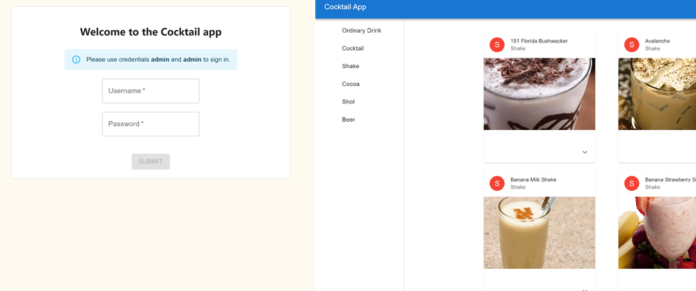

# CocktailApp
Cocktail (demo) app allows to browse a collection of fine beverages.

## Getting Started

#### 1. Dependencies
* [NodeJS](http://nodejs.org/) (v.14+)

#### 2. Clone and install
* Clone the repo: `git clone https://github.com/ahlav/CocktailApp.git`
* Install dependencies: `npm install`

#### 3. Development
* `node server.js`: Starts server - needed for authentication
* `npm run start`: Starts dev-env

#### 4. Testing
- `npm run test`: Runs unit tests
- `npm run test-e2e`: Runs e2e tests with puppeteer in headless mode

#### 5. Credits
- Components from [MaterialUI](https://mui.com/)
- Cocktail API: [TheCocktailDB](https://www.thecocktaildb.com/api.php)
- App set up with [Create-react-app](https://create-react-app.dev/)